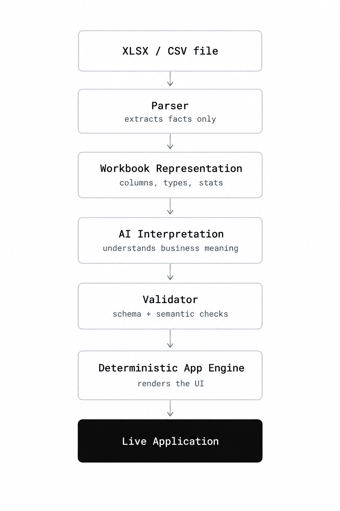
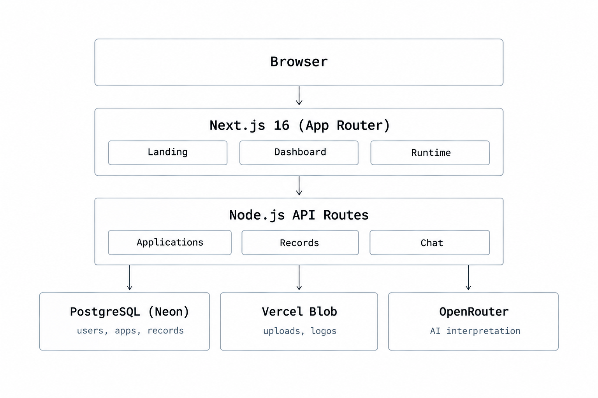

# Architecture

SheetForge turns a spreadsheet into a working web application by splitting the job in two: an AI decides what the app should be, and a fixed engine builds it.

## The core thesis

**AI interprets. Deterministic code executes.**

The model never produces anything that runs. Its only output is a JSON Application Definition: entities, fields, metrics, and charts. That definition is validated, stored, and handed to a runtime engine that was written, tested, and shipped by us.

This split avoids the failure modes of "AI generates code and hopes it works":

- No generated SQL, so no injection surface and no malformed queries.
- No generated UI code, so no broken builds and no unreviewed behavior.
- Reproducibility. The same definition always renders the same app.
- Graceful failure. A bad model response is rejected at the validator, not discovered at runtime.

The AI is a designer with a strict brief, not an engineer with production access.

## The pipeline

```
  Upload (XLSX / CSV)
        │
        ▼
  File validation ── type, size, limits
        │
        ▼
  Parser ── PapaParse (CSV) · SheetJS (XLSX)
        │
        ▼
  Workbook representation ── sheets, columns, typed cells
        │
        ▼
  AI input builder ── compact structural summary
        │
        ▼
  LLM (OpenRouter, multi-model fallback)
        │
        ▼
  Application Definition (JSON)
        │
        ▼
  Validator ── schema · semantic · source-reference
        │
        ▼
  Record importer ── rows into PostgreSQL
        │
        ▼
  Runtime engine ── renders from the definition
        │
        ▼
  Live application
  
```


**File validation** rejects wrong file types, oversized files, and uploads beyond the user's plan limits before any parsing happens.

**Parser** reads CSV with PapaParse and XLSX with SheetJS. Both feed the same downstream code.

**Workbook representation** is a single normalized structure for both formats: sheets, columns, and cell values with inferred types. Everything after this point is format-agnostic.

**AI input builder** reduces the workbook to a compact summary of structure and sample values. This is the only thing the model sees.

**LLM** proposes an Application Definition. It is called through OpenRouter with fallback across models.

**Validator** checks the proposal. Nothing reaches storage or the UI unless it passes.

**Record importer** writes the spreadsheet rows into PostgreSQL as records tied to the application and entity.

**Runtime engine** reads the stored definition and renders the application: summary, metrics, charts, views, editing, pivots, sharing, and export.

## Key decisions

### PostgreSQL and Prisma, not a document store

Spreadsheet data looks schemaless, but applications built on it are not. Users filter, sort, paginate, aggregate, and share subsets. Those operations want a real query planner, transactions, and constraints. Ownership, sharing, and membership are relational by nature. Prisma gives typed access and migrations, so the data layer is checked at compile time instead of trusted at runtime. Row-level flexibility is preserved by storing each record's values as JSON, while everything around it stays relational.

### A controlled app engine, not AI-generated code

Generated code has to be reviewed, sandboxed, and debugged per app. A fixed engine is reviewed once and works for every app. It also means a fix or improvement to the engine benefits every existing application immediately, because apps are data, not deployments.

### Validating AI output: schema, semantic, and source-reference

Model output is untrusted input, so it is checked in three layers:

- **Schema:** the JSON has the expected shape, types, and allowed values.
- **Semantic:** the definition makes sense as an application. Metrics and charts use supported types and apply to fields where they are meaningful.
- **Source reference:** every field the definition mentions maps to a real column in the uploaded workbook. The model cannot invent data that does not exist.

A definition that fails any layer is rejected. Structural correctness is enforced by code, not by asking the model nicely.

### A compact summary for the LLM, not the full data

The model needs to understand structure, not read every row. Sending a compact summary keeps requests fast and cheap, fits inside context limits regardless of file size, and limits how much of a user's data leaves our infrastructure. It also shrinks the surface for prompt injection, since far less attacker-controlled text reaches the model.

### Private blob storage for spreadsheets

Uploaded spreadsheets often contain business or personal data. Files live in private Vercel Blob storage and are never exposed by a public URL. Access happens server-side, after an ownership check. Public sharing is a feature of the rendered application, not of the underlying file.

### Multi-model fallback for AI

Free and low-cost models get rate limited, degrade, or are retired without notice. Routing through OpenRouter lets us define an ordered list of models and fall through it on failure, so a single provider outage or deprecation does not take down app creation. It also keeps the codebase provider-agnostic. Because every model must satisfy the same validator, swapping models never changes the trust model.

### Auth.js v5

Auth.js v5 is built for the App Router. One `auth()` call works in server components and route handlers, so session checks happen on the server next to the data they protect. It avoids running our own session and credential handling, which is the wrong place to be creative.

## Data model

```
User
 └── Application
      ├── Definition      (JSON: entities, fields, metrics, charts, rules)
      ├── Workbook        (reference to the private uploaded file)
      ├── Records         (entity name + JSON data, one row each)
      ├── ShareTokens     (invite links)
      ├── Members         (role: editor | viewer)
      └── ChatMessages    (AI chat history)
```


The Application Definition is the pivot of the system. The AI writes it, the validator gates it, and the runtime reads it. Records hold only data; the definition holds all meaning: which entities exist, which fields are visible, which metrics and charts to show, which conditional rules apply. Changing how an app looks or behaves is a change to the definition, not to code or schema. This is why customization, multi-entity tabs, and conditional formatting all fit into the same model without special cases.

## Security model

Three hard rules:

1. **Never trust the browser.** Every API route re-checks the session, ownership, and role on the server. Client-side state is a convenience, not a control.
2. **Never trust the spreadsheet.** Cell contents are data, never instructions. File type, size, and shape are validated before parsing, and values are treated as untrusted when rendered.
3. **Never trust the LLM.** Model output passes the validator before it is stored or used. Chat answers are constrained to text plus an optional chart payload.

Additional protections:

- **Row-level ownership.** Queries are scoped to the application and the requesting user's access.
- **Role-based access.** Owner, editor, and viewer roles are checked centrally for every application.
- **Private storage.** Uploaded files are never publicly addressable.
- **No AI-generated code.** Nothing the model returns is executed.
- **Server-side API keys.** Model and storage credentials never reach the client.
- **Prompt injection resistance.** The model sees a compact summary, its output is schema-validated, and it has no tools that act on data.
- **Usage tracking.** Per-user limits on apps, AI generations, and edits bound the cost and blast radius of abuse.

## Performance

What we don't do:

- No AI calls on page load. Rendering an app never waits on a model.
- No full data dump to the model or the browser.
- No unbounded fetches. Lists are always paginated.

What we do:

- **Persist AI output once.** The definition is generated at creation time and stored. Every later view reads it from the database.
- **Use compact summaries.** Model input size depends on the shape of the file, not the number of rows.
- **Paginate records.** The runtime loads a page at a time.

## Future work

- Payments and paid plans
- Custom domains for published apps
- Email invitations for team sharing
- Advanced formula support
- Scheduled exports
- Team workspaces
- Column-level permissions
- Audit log

## Learnings

The most interesting engineering challenge was trusting AI enough to be useful without letting it be dangerous. Constraining the model harder made it more useful, not less: once its output became a validated, structured contract with a deterministic engine, its mistakes became rejected inputs instead of production incidents, and the parts we trust most stayed the parts written by hand.