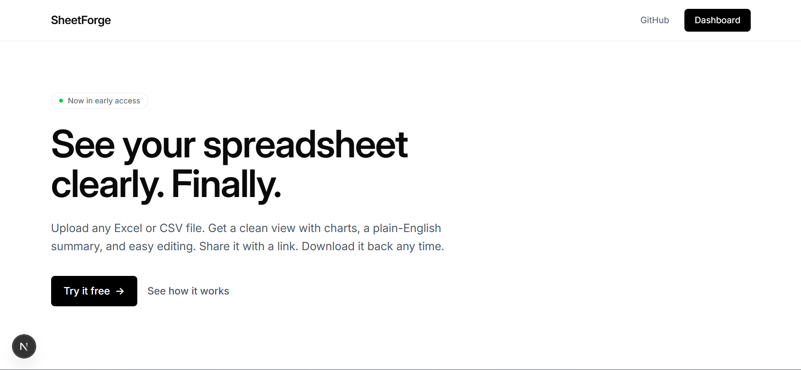
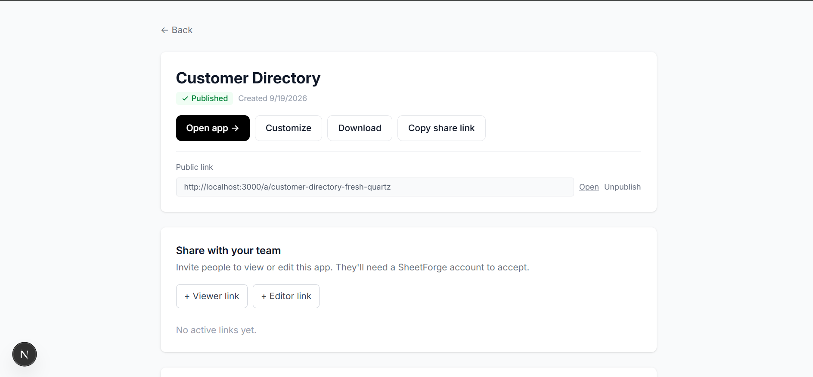
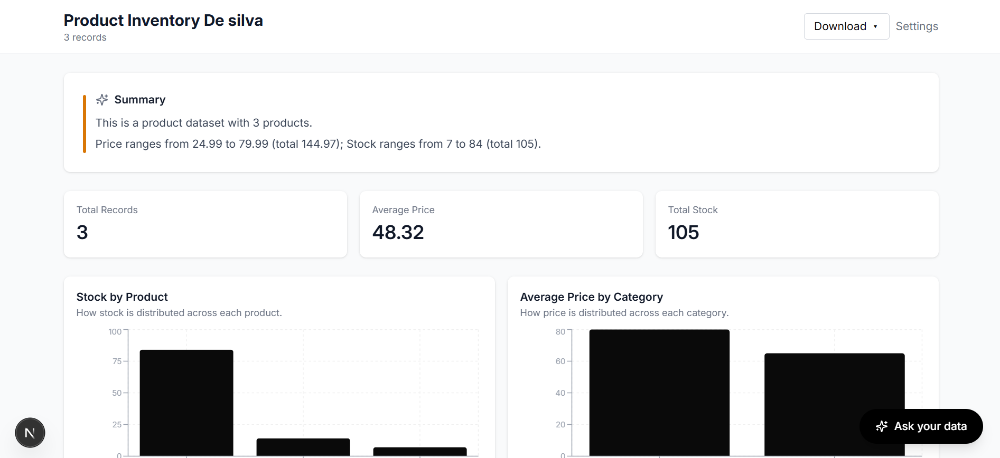
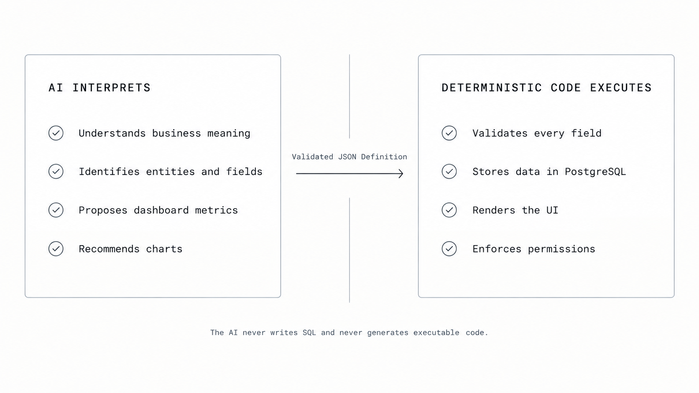
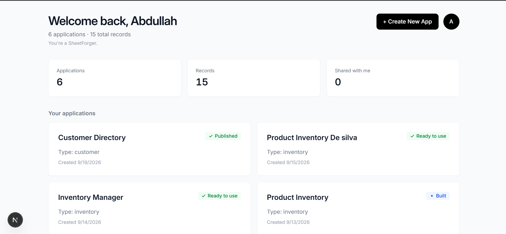
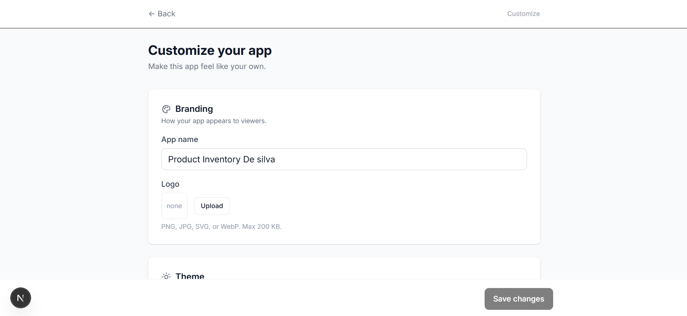
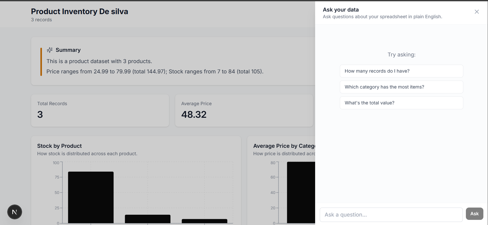

# SheetForge

Turn any spreadsheet into a friendly, shareable web application. AI understands the structure; a deterministic engine renders a real app backed by PostgreSQL.

**Live demo: [https://sheetforge-one.vercel.app](https://sheetforge-one.vercel.app)**



## The problem

Spreadsheets are the world's most popular database, and they are a poor one. Data gets duplicated, formulas break silently, and sharing means emailing a file or handing out edit access to everyone. Building a proper application on top of that data means schemas, a backend, a UI, and auth, which is weeks of work for what started as a single file. Most teams never make the jump.

## How it works

```
 Upload ─▶ Understand ─▶ AI designs ─▶ Validate ─▶ Generate ─▶ Use
  file      parse &       Application    schema      records     browse,
            profile       Definition     check       + app       edit, share
                          (JSON)
```

**1. Upload.** Drop in an XLSX or CSV file. Multi-sheet workbooks are supported, and each sheet can become its own entity.

**2. Understand.** The file is parsed with PapaParse or SheetJS. Columns are profiled so the AI sees real structure and sample values, not just headers.

**3. AI designs.** The model decides what the application should be: entities, fields, dashboard metrics, and charts. Its only output is a JSON Application Definition.

**4. Validate.** The definition is checked against a strict schema. Anything malformed or unsupported is rejected before it can affect the app.

**5. Generate.** Your rows are stored as records in PostgreSQL, and the definition is saved alongside them.

**6. Use.** A fixed runtime renders the app from the definition: summary, metrics, charts, views, editing, pivots, sharing, and export.

<p align="center">
  
  
</p>

## Why this is different

**The AI interprets. Deterministic code executes.**

Most "AI app builders" ask a model to write code and hope it runs. SheetForge splits the work along a hard line:

- The AI only decides **what** the application should be: entities, fields, metrics, and charts, expressed as a validated JSON Application Definition.
- A fixed, tested engine renders the app from that definition. The same definition always produces the same app.
- The AI never writes SQL and never generates executable code.
- Its output is schema-validated before anything runs.

The result is an app that behaves like software you wrote by hand, because the part that executes is software you wrote by hand.



## Feature overview

| Category | Features |
| --- | --- |
| Import | XLSX and CSV upload, multi-sheet workbooks |
| AI | Structure understanding, automatic app design, plain-English summary, chat to ask questions about your data with charts |
| Runtime app | Dashboard metrics, charts with plain-English insights, card and list views, record detail, search, filters, sort, pagination |
| Data editing | Full CRUD on records, conditional formatting rules (for example, red when stock < 10) |
| Analysis | Pivot tables with a simplified three-dropdown UI, multi-entity tabs (Products, Suppliers, and so on) |
| Customization | App name, logo, three themes, field visibility, metric visibility |
| Sharing | Public read-only URLs, team sharing by invite link with viewer and editor roles |
| Export | CSV and XLSX export, so edits round-trip back to a spreadsheet |
| Account | Usage tracking with Free tier limits and admin bypass, account settings (profile, delete account) |



## Architecture

```
                 ┌──────────────────────────────────────────┐
                 │        Next.js 16 (App Router)           │
  Browser ─────▶ │  Server components + API routes (Node)   │
                 └───────┬───────────────┬──────────────┬───┘
                         │               │              │
                   ┌─────▼─────┐   ┌─────▼──────┐  ┌────▼─────┐
                   │  Parsers  │   │ AI (OpenRouter) │ Auth.js  │
                   │ PapaParse │   │ definition │  │   v5     │
                   │  SheetJS  │   │ JSON only  │  └──────────┘
                   └─────┬─────┘   └─────┬──────┘
                         │         ┌─────▼──────┐
                         │         │ Validation │
                         │         └─────┬──────┘
                   ┌─────▼───────────────▼──────┐   ┌─────────────┐
                   │ PostgreSQL (Neon) + Prisma │   │ Vercel Blob │
                   └────────────────────────────┘   │ (files)     │
                                                     └─────────────┘
```

A deeper walkthrough of the definition schema, the runtime, and the data model lives in [ARCHITECTURE.md](ARCHITECTURE.md).

## Tech stack

| Layer | Technology |
| --- | --- |
| Frontend | Next.js 16 (App Router), React 19, TypeScript, Tailwind CSS v4 |
| Backend | Next.js API routes (Node.js runtime) |
| Database | PostgreSQL (Neon) with Prisma ORM |
| Auth | Auth.js v5 |
| File storage | Vercel Blob (private) |
| Parsing | PapaParse (CSV), SheetJS (XLSX) |
| AI | OpenRouter (provider-agnostic, multi-model fallback) |
| Charts | Recharts |
| Deployment | Vercel + GitHub |

## Project structure

```
sheetforge/
├── app/
│   ├── app/[id]/          # Owner runtime: dashboard, records, pivot, chat panel
│   ├── a/[slug]/          # Public read-only pages
│   ├── dashboard/         # App list, per-app settings, account settings
│   ├── api/               # Route handlers (applications, account, ...)
│   └── layout.tsx         # Root layout, fonts, metadata
├── components/ui/         # Shared UI primitives (Button, Input)
├── lib/
│   ├── access/            # Ownership and sharing role checks
│   ├── charts/            # Chart data computation and plain-English insights
│   ├── conditional/       # Conditional formatting rules
│   ├── fields/            # Field value rendering (email, url, image, ...)
│   ├── summary/           # Plain-English summary generation
│   ├── usage/             # Free tier limits and usage tracking
│   └── prisma.ts          # Prisma client
├── prisma/                # Schema and migrations
├── docs/screenshots/      # README images
├── auth.ts                # Auth.js configuration
└── ARCHITECTURE.md
```



## Running locally

**Prerequisites**

- Node.js 20.9 or later
- A PostgreSQL database (a free Neon project works)
- An OpenRouter API key
- A Vercel Blob read/write token

**Setup**

```bash
git clone https://github.com/abdullah804-stack/sheetforge.git
cd sheetforge
npm install

cp .env.example .env.local     # then fill in the values
npx prisma migrate dev         # create the database schema
npm run dev
```

Open [http://localhost:3000](http://localhost:3000).

## Environment variables

| Variable | Purpose |
| --- | --- |
| `DATABASE_URL` | PostgreSQL connection string |
| `AUTH_SECRET` | Auth.js session encryption secret |
| `BLOB_READ_WRITE_TOKEN` | Vercel Blob access for uploaded files |
| `OPENROUTER_API_KEY` | AI model access through OpenRouter |
| `OPENROUTER_MODEL` | Model slug (e.g. `openrouter/free`) |
| `ADMIN_EMAILS` | Comma-separated emails that bypass usage limits (for development) |

See [.env.example](.env.example) for the complete list.



## Status

**Working and deployed:** everything listed under Feature overview.

**Known limits:**

- Dashboard metrics and charts apply to the primary entity only. Supporting-entity tabs show record counts and records.
- Pivot tables are a deliberately simplified three-dropdown version, not a full Excel pivot engine.
- Charts in AI chat answers are bar and pie.
- Public pages are read-only and do not include the chat panel.
- Free tier limits apply to apps, AI generations, manual edits, records per app, and file size.

## License

MIT

## Built by

**Muhammad Abdullah** ([@abdullah804-stack](https://github.com/abdullah804-stack))